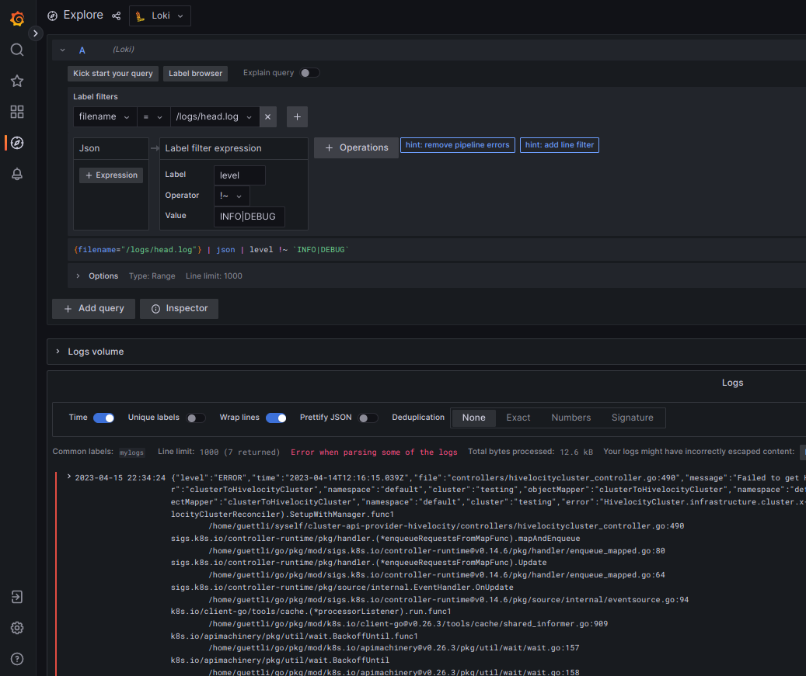

# Local Loki/Grafana Setup

This local Loki/Grafana setup is for **ad-hoc log analyzing**.

By "ad-hoc" I mean that you start Promtail/Loki/Grafan on your local machine, and
add the logs which you want to analyze today by hand.

It is not suited for continuous log handling.

It is based on the docker-compose files of [Loki Docs](https://grafana.com/docs/loki/latest/getting-started/#obtain-the-test-environment).

# Start Grafana, Loki and Promtail

Grafana: Web-GUI for querying the logs.

Loki: Log aggregation system (without GUI)

Promtail: Agent which ships the contents of local logs to a Loki instance.

Minio: s3 storage for Loki. Data is in .data/minio/.

All three services get started via docker-compose:

```
reset; docker-compose up
```

I use `reset` here so that it is easier to check the current output of the services.

Keep this terminal, and open a second terminal for the next steps.

# Add logs

Above docker-compose mounts the ./logs directory and imports the containing logs.

Now we add logs to the ./logs directory. 

I have an application in a Kubernetes cluster that
emits logs in long json-lines. But AFAIK other log formats should work, too. I use `kubectl` -
use your preferred way.

```
mkdir -p logs
kubectl logs foo-pod > logs/foo.logs
```

Hint: don't add too many lines at the beginning. I accidentally started with 1 million lines,
which caused timeouts.

# Use the Web-GUI

```
open http://localhost:3000
```

Click on "Explore" (🧭), then at the top choose "Loki".

Hint: Check the time range (left to the button "Run query"). If you import old logs,
they might get ignored if the time range does not match.

Hint2: Too large time ranges (like "this year") might cause an error:

> The query time range exceeds the limit (query length: 43824h0m0s, limit: 721h0m0s)


# Misc

## How to delete all logs?

```
# stop docker-compose (ctrl-c)

sudo rm -rf .data/minio

reset; docker-compose up
```


## How to get the command-line arguments that promtail accepts?

```
docker run grafana/promtail:2.8.0 --help
```

## Troubleshooting Promtail

```
cat logs/your-file.log | docker run grafana/promtail --stdin --dry-run --client.url http://127.0.0.1:3100/loki/api/v1/push
```

# Screenshots




In the above screenshot, you see a label filter. I exclude lines that have level INFO or DEBUG.

And you see one reason why I wanted to switch from traditional unix tools (pipe/grep/sed/jq) to a GUI. 

One line contains a traceback with newlines. With the button "escape newlines" the lines get displayed, so that my
human eyes can read them.

Trying to parse lines like this with eyes is .... (choose your own words here please)

```
{"level":"ERROR","time":"2023-04-14T12:16:15.030Z","file":"controllers/hivelocitycluster_controller.go:490","message":"Failed to get HivelocityCluster","objectMapper":"clusterToHivelocityCluster","namespace":"default","cluster":"testing","error":"HivelocityCluster.infrastructure.cluster.x-k8s.io \"testing\" not found","stacktrace":"github.com/hivelocity/cluster-api-provider-hivelocity/controllers.(*HivelocityClusterReconciler).SetupWithManager.func1\n\t/home/guettli/syself/cluster-api-provider-hivelocity/controllers/hivelocitycluster_controller.go:490\nsigs.k8s.io/controller-runtime/pkg/handler.(*enqueueRequestsFromMapFunc).mapAndEnqueue\n\t/home/guettli/go/pkg/mod/sigs.k8s.io/controller-runtime@v0.14.6/pkg/handler/enqueue_mapped.go:80\nsigs.k8s.io/controller-runtime/pkg/handler.(*enqueueRequestsFromMapFunc).Create\n\t/home/guettli/go/pkg/mod/sigs.k8s.io/controller-runtime@v0.14.6/pkg/handler/enqueue_mapped.go:57\nsigs.k8s.io/controller-runtime/pkg/source/internal.EventHandler.OnAdd\n\t/home/guettli/go/pkg/mod/sigs.k8s.io/controller-runtime@v0.14.6/pkg/source/internal/eventsource.go:63\nk8s.io/client-go/tools/cache.(*processorListener).run.func1\n\t/home/guettli/go/pkg/mod/k8s.io/client-go@v0.26.3/tools/cache/shared_informer.go:911\nk8s.io/apimachinery/pkg/util/wait.BackoffUntil.func1\n\t/home/guettli/go/pkg/mod/k8s.io/apimachinery@v0.26.3/pkg/util/wait/wait.go:157\nk8s.io/apimachinery/pkg/util/wait.BackoffUntil\n\t/home/guettli/go/pkg/mod/k8s.io/apimachinery@v0.26.3/pkg/util/wait/wait.go:158\nk8s.io/apimachinery/pkg/util/wait.JitterUntil\n\t/home/guettli/go/pkg/mod/k8s.io/apimachinery@v0.26.3/pkg/util/wait/wait.go:135\nk8s.io/apimachinery/pkg/util/wait.Until\n\t/home/guettli/go/pkg/mod/k8s.io/apimachinery@v0.26.3/pkg/util/wait/wait.go:92\nk8s.io/client-go/tools/cache.(*processorListener).run\n\t/home/guettli/go/pkg/mod/k8s.io/client-go@v0.26.3/tools/cache/shared_informer.go:905\nk8s.io/apimachinery/pkg/util/wait.(*Group).Start.func1\n\t/home/guettli/go/pkg/mod/k8s.io/apimachinery@v0.26.3/pkg/util/wait/wait.go:75"}
```

Additionally, there is one warning "Error while parsing some of the logs". That's because some lines were not json-lines,
but traditional log lines.

# Alternatives

* [ax](https://github.com/egnyte/ax) command line tool for structured logs.

# Related

* [Thomas WOL: Working out Loud](https://github.com/guettli/wol)

# Feedback

I love feedback and I love to hear from you. Just create an issue and tell me what's on your mind.

